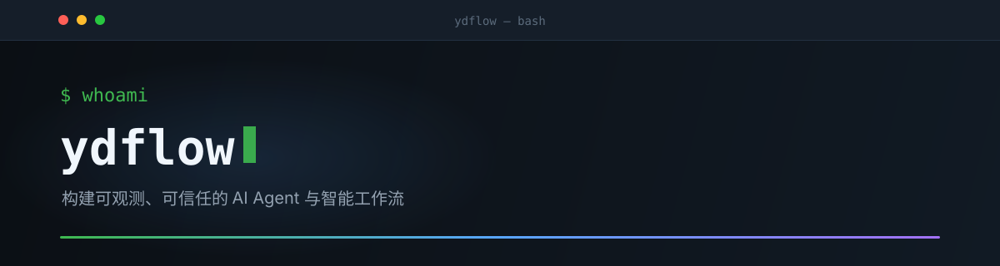

### 构建可观测、可信任的 AI Agent 与智能工作流

`AI Agent` · `LLM 应用` · `TypeScript` · `Python`

 

---

### 🧭 我在做什么

我在做 **AI Agent 与智能工作流** 方向：让 Agent 不止能对话，还能**看见屏幕、理解任务、执行到底**。

- 🤖 **Agent 能力落地** — 剪映视频自动化 Skill、从一句话到数字人的全链路回应
- 🧩 **工程基本功** — 微信原生 TypeScript 小程序、React + Node.js 应用
- 📚 **持续跟踪前沿** — AgentScope、Qwen-Agent、trae-agent、page-agent、ZCode、open-agent-auth

---

### 🛠️ 技术栈

**语言** — TypeScript（主力）· JavaScript · Python · GLSL

**Agent 栈** — AgentScope · Qwen-Agent · MCP · Function Calling · RAG

**应用侧** — React + Node.js · 微信原生小程序 · DeepSeek · 火山引擎

**数字人 / 视觉** — LivePortrait · MuseTalk · ffmpeg 转码

---

### 📌 置顶项目

<table>
  <tr>
    <td width="50%" valign="top">
      <h4><a href="https://github.com/ydflow/cyber-girlfriend-16gb">🤖 cyber-girlfriend-16gb</a></h4>
      
面向 16GB 显存设备的 AI 陪伴项目：自定义角色、语音聊天、情绪表情与口型视频。  
      <code>React</code> <code>Node.js</code> <code>Python</code> <code>LivePortrait</code> <code>MuseTalk</code>

    </td>
    <td width="50%" valign="top">
      <h4><a href="https://github.com/ydflow/rixu-miniprogram-open">📅 rixu-miniprogram-open</a></h4>
      
「日序 · 每天都有安排」—— 本地优先的微信原生 TypeScript 日程管理小程序。  
      <code>TypeScript</code> <code>微信小程序</code> <code>本地优先</code>

    </td>
  </tr>
  <tr>
    <td width="50%" valign="top">
      <h4><a href="https://github.com/ydflow/jianying-editor-skill-reliable">🎬 jianying-editor-skill-reliable</a></h4>
      
剪映自动化 Agent Skill 可靠增强版：安全草稿备份、只读诊断、版本预检、媒体保真与真实 MP4 转码。  
      <code>Python</code> <code>Agent Skill</code> <code>自动化</code>

    </td>
    <td width="50%" valign="top">
      <h4><a href="https://github.com/ydflow/rixu-miniprogram">📱 rixu-miniprogram</a></h4>
      
日序日程小程序初版，<code>rixu-miniprogram-open</code> 为其开源演进版本。  
      <code>TypeScript</code> <code>微信小程序</code>

    </td>
  </tr>
</table>

---

### 📊 GitHub Metrics

---

### 🕘 最近活动

<!--START_SECTION:activity-->
<!--END_SECTION:activity-->

---

🌱 正在寻找 AI Agent 方向的工作机会

如果你想聊聊 Agent、自动化或微信小程序开发，欢迎通过 GitHub 联系我。

