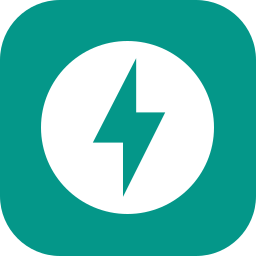
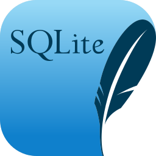
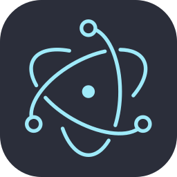

  

  

  
  
  

## 👋 关于我

你好，我是 **ydflow**，一名 **2028 届本科生**，目前正在寻找 **AI Agent 开发相关实习**。

我关注 Agent 如何在真实工具与长任务中可靠工作：工具调用是否受权限约束，状态能否恢复，结论能否追溯证据，失败能否通过 Trace / Eval 被发现和复现。我在个人项目与已合并的上游 PR 中持续验证这些问题。

我也探索 **AI 数字人**的交互与记忆表达，并将金融研究兴趣落实在本地 AI 投资研究工作台「研迹」。欢迎通过 [邮箱](mailto:m5a5@163.com) 交流。

## 🛠️ 技术与创作工具

  
  

  
  
  
  
  

---

## 上游贡献 · 已合并

- **执行边界 · [AgentScope #2883](https://github.com/agentscope-ai/agentscope/pull/2883) / [TeamAI #951](https://github.com/Tencent/teamai-cli/pull/951)** — 收紧 Bash 只读判定，阻止可写 Git 命令绕过权限流程；让 `update --dry-run` 只检查版本，不安装或写入检查状态。
- **并发持久化 · [TeamAI #841](https://github.com/Tencent/teamai-cli/pull/841) / [#855](https://github.com/Tencent/teamai-cli/pull/855) / [#961](https://github.com/Tencent/teamai-cli/pull/961)** — 为事件日志、状态与索引、跨进程会话日志补上锁协调和原子替换，处理竞争覆盖与截断读取。
- **知识召回 · [TeamAI #891](https://github.com/Tencent/teamai-cli/pull/891) / [#902](https://github.com/Tencent/teamai-cli/pull/902) / [OpenViking #5312](https://github.com/volcengine/OpenViking/pull/5312)** — 统一多来源召回的排序尺度、隔离知识域 IDF 统计，并接通 DSH 插件的召回子树排除配置。
- **Agent 运行时 · [AgentScope #2860](https://github.com/agentscope-ai/agentscope/pull/2860) / [Shep #883](https://github.com/shep-ai/shep/pull/883)** — 验证重试时保留多模态目标块；MCP 服务关闭时等待退出、超时升级终止，并处理 Windows 进程树。

## 项目实践

- **[研迹 · ResearchTrail](https://github.com/ydflow/research-trail)** — 已发布 Windows v1.0.0 的本地 AI 投资研究工作台；串联资料采集、可追溯报告、论点复审与 Today 简报，用离线案例回归 Agent 流程。
- **[故障智巡 · Incident Response Agent](https://github.com/ydflow/incident-response-agent)** — 线上服务故障调查与模拟处置平台；在本地受控演示中只读取证、引用证据诊断，通过审批门控与事件回放记录决策；尚未接入生产处置。
- **[剪映自动化 Skill · Reliable Edition](https://github.com/ydflow/jianying-editor-skill-reliable)** — 在 [上游项目](https://github.com/luoluoluo22/jianying-editor-skill) 基础上的可靠性增强：草稿备份、只读诊断、版本预检、媒体保真与真实 MP4 转码。
- **[AI Digital Human](https://github.com/ydflow/cyber-girlfriend-16gb)** — 支持自定义角色的逐轮语音数字人原型；串联云端语音与对话服务、本地口型和表情视频生成。
- **[日序 · 每天都有安排](https://github.com/ydflow/rixu-miniprogram-open)** — 开发中的本地优先微信原生 TypeScript 日程小程序；支持事项、日历与专注，可选 CloudBase 同步。

---

  
  
  

